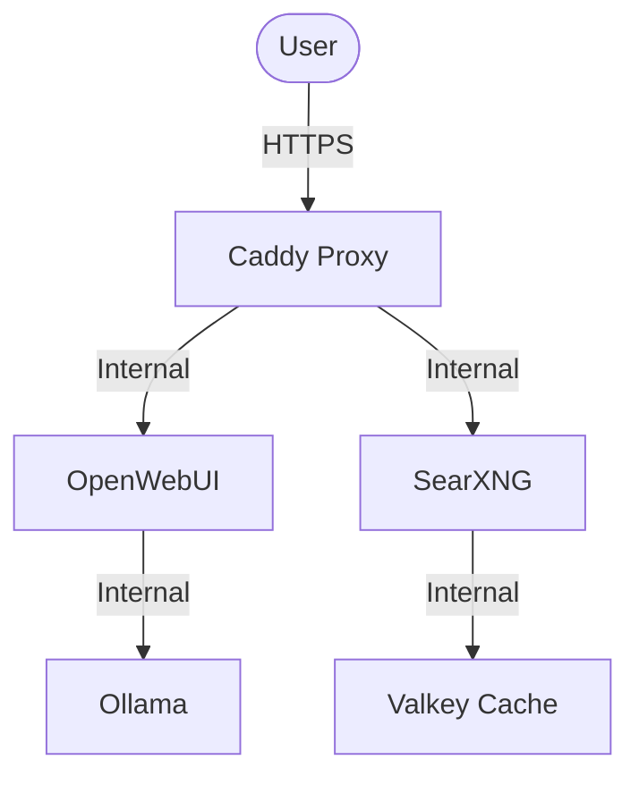

# Raspberry Pi 5 OpenWebUI Stack

A high-performance, self-hosted AI suite optimized for the Raspberry Pi 5. This stack includes OpenWebUI for the interface, Ollama for local model inference, SearXNG for privacy-respecting web search, and Caddy as a secure reverse proxy.

## Architecture



## Setup Instructions

### 1. Prerequisites
- **Hardware**: Raspberry Pi 5 (16GB RAM recommended).
- **OS**: Ubuntu Server or Raspberry Pi OS (64-bit).
- **Software**: Docker and Docker Compose installed.

### 2. Configuration
Create a `.env` file in the root directory based on this template:

```env
# Domain names
SEARXNG_BASE_URL=search.example.com
OPENWEBUI_HOSTNAME=ai.example.com
CLIPROXY_HOSTNAME=proxy.example.com

# Email for Let's Encrypt
LETSENCRYPT_EMAIL=your-email@example.com

# Secrets (Generate with: openssl rand -hex 32)
WEBUI_SECRET_KEY=paste_random_key_here
SEARXNG_SECRET=paste_another_random_key_here
```

### 3. Deployment
```bash
docker compose up -d
```

## Maintenance

### Updating Services
```bash
docker compose pull
docker compose up -d --remove-orphans
```

### Checking Logs
```bash
docker compose logs -f
```

### Open WebUI Configuration
Open WebUI is primarily configured via environment variables. For a full list of available options:
1. See [openwebui/config.example.env](file:///home/dryamov/Repositories/rpi5-openwebui/openwebui/config.example.env).
2. To use these variables, you can add them to your root `.env` file or directly in `docker-compose.yml`.

> [!NOTE]
> Open WebUI stores many settings in its internal database (PersistentConfig). To force it to reload from environment variables, set `ENABLE_PERSISTENT_CONFIG=false`.

## Резервное копирование и восстановление (Backup & Restore)
Для защиты ваших данных предусмотрена масштабируемая система бэкапов в папке `scripts/`. Скрипты работают с локальными файлами и Docker томами.

### Особенности V2
- **Конфигурация**: Все настройки вынесены в `scripts/backup.config`.
- **Авто-обнаружение**: Скрипт автоматически находит тома с меткой `com.backup=true` (настроено в `docker-compose.yml`).
- **Безопасность**: Используется `trap` для автоматического запуска контейнеров при прерывании бэкапа.
- **Удаленное хранилище**: Поддержка `rclone` для отправки архивов в облако (Gdrive, S3 и др.).

### Создание бэкапа
Запустите скрипт:
```bash
./scripts/backup.sh
```
- Скрипт создаст архив в папке `./backups`.
- По умолчанию исключаются тяжелые данные (модели Ollama), что экономит место.
- Старые копии (старше 7 дней) удаляются автоматически.

### Восстановление
```bash
./scripts/restore.sh ./backups/rpi5-openwebui_backup_XXXX.tar.gz
```
- **Внимание**: Текущие данные будут перезаписаны! Скрипт восстановит и файлы проекта, и содержимое Docker томов.

## Optimization for RPi5
- **Resource Limits**: Configured in `docker-compose.yml` to prevent system crashes.
- **Valkey**: Used by SearXNG for ultra-fast result caching.
- **RAG Server Architecture**: RPi5 functions as a dedicated RAG server, offloading LLM inference to remote APIs to ensure high performance and stability.

## Security Hardening
### Production CORS
To avoid the `CORS_ALLOW_ORIGIN is set to '*'` warning in production:
1. Set `ENABLE_CORS=true` in your `.env`.
2. Set `CORS_ALLOW_ORIGIN=https://your-domain.com` to restrict access to your specific domain.